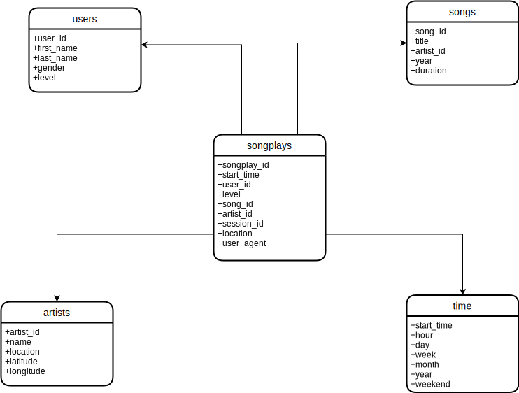

# The purpose and the goal of database, Sparkify
The purpose of the database Sparkify is to analyze the data collecting on songs and user activities for a new music streaming app.
The goal is to create a Postgres database with tables designed to optiize queries on song play analysis. 
My role is to create a database schema and ETL pipeline for this analysis.

# Database schema design

## Fact Table
1. songplays - records in log data associated with song plays i.e. records with page NextSong
* songplay_id, start_time, user_id, level, song_id, artist_id, session_id, location, user_agent

## Dimension Tables
2. users - users in the app
* user_id, first_name, last_name, gender, level

3. songs - songs in music database
* song_id, title, artist_id, year, duration

4. artists - artists in music database
* artist_id, name, location, latitude, longitude

5. time - timestamps of records in songplays broken down into specific units
* start_time, hour, day, week, month, year, weekday

# ETL pipeline

## Extraction
The extraction process has been done with two main files: song_data nd log_data.
## Transform
The transform process has been separated with five independent processes.
* Song_data has been processed to create songs and artists dimensional tables.
* log_data is process to create tiem and users diemensional datables as well as the songplays fact table.

## Load
Those dimensional data tables and fact table data table are loaded on their tables.